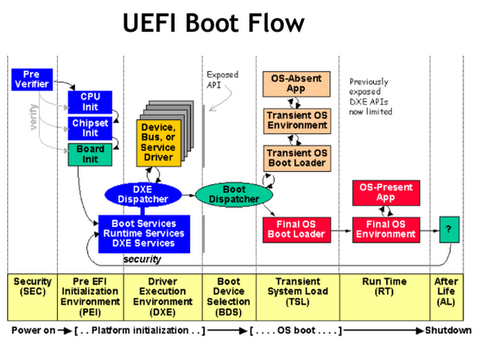

# Understanding NVIDIA Jetson Boot Flow

MB1 → MB2 → UEFI → OS

## UEFI images on Jetson: `uefi_jetson.bin` vs `uefi_jetson_minimal.bin`

### 1) Where they come from (Yocto recipes)

These binaries are built from NVIDIA’s EDK2 firmware recipes:

- `edk2-firmware-tegra_36.4.4.bb` → produces `uefi_jetson.bin`
- `edk2-firmware-tegra-minimal_36.4.4.bb` → produces `uefi_jetson_minimal.bin`

So there is a “full” build and a “minimal” build of the UEFI firmware.

### 2) How they are used during flashing / recovery

From `tegra-flash-helper.sh`:

```bash
--cpubl uefi_jetson.bin \
--cpubl_rcm uefi_jetson_minimal.bin
```

This strongly suggests:
+ uefi_jetson.bin is the normal UEFI payload used for standard boot.
+ uefi_jetson_minimal.bin is used in RCM / recovery workflows (i.e., a smaller UEFI for recovery-mode bootstrapping).

Here is the partition info: [partition](https://docs.nvidia.com/jetson/archives/r36.4/DeveloperGuide/AR/BootArchitecture/PartitionConfiguration.html?highlight=tbcfile#list-of-translated-keywords)

### 3) What does Jetson UEFI do?
At a high level, Jetson UEFI plays a role similar to a “BIOS/UEFI firmware” on a PC:
+ Initializes platform services required to boot the OS
+ Provides UEFI Boot Manager and (optionally) a UEFI Shell
+ Includes NVIDIA-specific drivers/apps in addition to standard EDK II components

If you want to inspect what is present at runtime:
+ Enter UEFI Shell.
+ List files on FS0:\ (often ESP).
+ Enumerate available .efi applications/drivers.



[UEFI](https://docs.nvidia.com/jetson/archives/r36.4/DeveloperGuide/AR/BootArchitecture/JetsonOrinSeriesBootFlow.html#uefi)

### 4) TODO
+ Can we embed Secure Boot keys into uefi_jetson.bin to auto-enroll them, then delete the source after enrollment?
+ 21/01: First approach: Using DXE
    + The idea is put our all auth keys under `fs0:`. And do it by defined SECTION RAW in EDK2.
    + Create QualgoSecureBootDxe will check if secureboot is enabled or not, if not and SetupMode = 1, then try to enroll secure boot keys and reboot. If Secure boot already enabled, continue to boot.
    ```bash
    FS0:\> ls
    Directory of: FS0:\
    00/00/0000  00:00       r       6,029  11111111-1111-1111-1111-111111111111 # db.auth
    00/00/0000  00:00       r       3,316  22222222-2222-2222-2222-222222222222 # KEK.auth
    00/00/0000  00:00       r       3,314  33333333-3333-3333-3333-333333333333 # PK.auth
    ```

    + Produce uefi_jetson.bin and replace with the original one in extracted tegraflash. And reflash the device.
    ```bash

    [QualgoSB] SetupMode=0 Status=Success
    [QualgoSB] SecureBoot=1 Status=Success
    [QualgoSB] Not in SetupMode, skip initial enrollment.

    ....

    root@jetson-orin-nano-devkit-nvme:~# efivar -n 8be4df61-93ca-11d2-aa0d-00e098032b8c-SecureBoot
    GUID: 8be4df61-93ca-11d2-aa0d-00e098032b8c
    Name: "SecureBoot"
    Attributes:
            Boot Service Access
            Runtime Service Access
    Value:
    00000000  01 
    ```