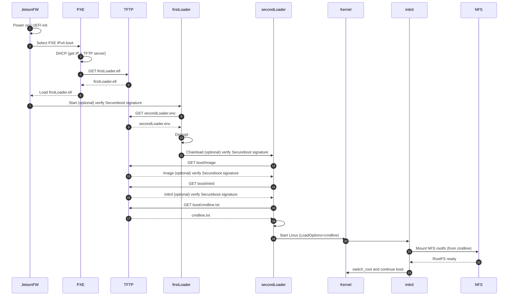

## UAV-720 - Add PXE Boot Support to Jetson Orin Nano
### Goal
+ Add a PXE-based boot path for Jetson that allows booting Linux from a server (kernel/initrd/cmdline over TFTP, rootfs over NFS), while keeping the existing default/local boot path intact.
+ This enables isolating or bypassing NVMe/local storage and controlling boot artifacts from the server side.

### Setup server side see [PXE Server Setup](pxe-setup.md)
### Components
bootaa64.efi (firstLoader.efi, Stage 1 Loader):

+ Runs after PXE boot selection or normal boot depending on Boot Option.
+ When Secure Boot is enabled:
    verifies signatures of loaded EFI images/artifacts (policy-specific)
+ Downloads secondLoader.enc from the server (TFTP).
+ Decrypts secondLoader.enc → secondLoader.efi.
+ Verifies secondLoader.efi (signature / integrity).
+ Chainloads into secondLoader.efi.

secondLoader.efi (Stage 2 Loader):

+ Chooses boot source:
    - Default/local: load Image and initrd from a local filesystem.
    - PXE: download Image, initrd, and cmdline.txt from server using PXE/TFTP.

Server-side Artifacts:

+ Delivered via TFTP:
    + bootaa64.efi
    + secondLoader.enc
    + Image
    + initrd
    + cmdline.txt
+ Root filesystem delivered via NFS:
    + NFS export contains rootfs (e.g. /volume1/nfs_root/)

### Boot flow:

