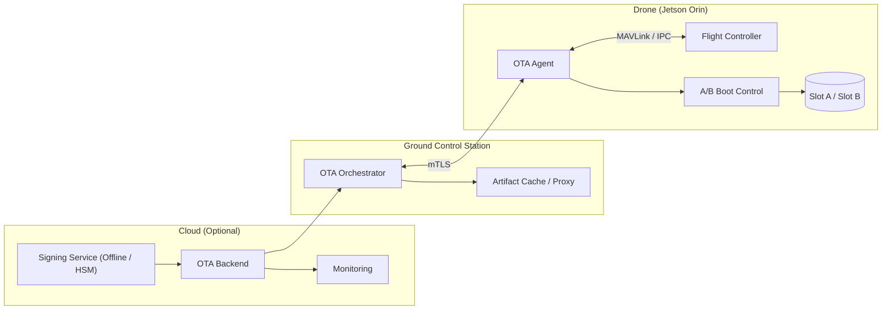
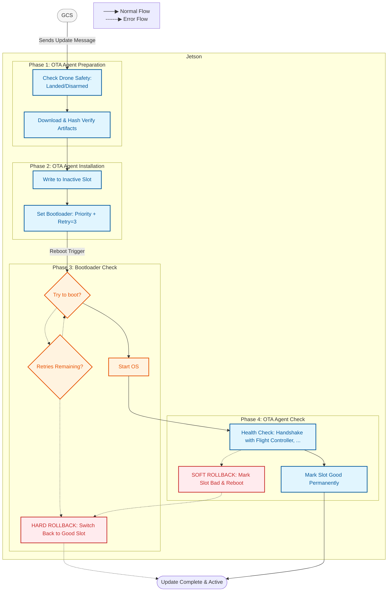
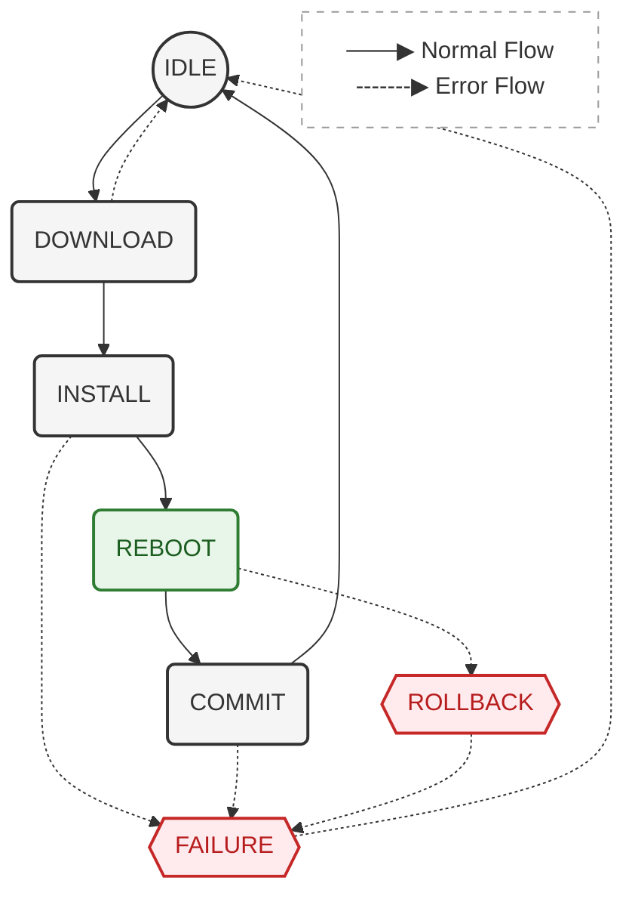
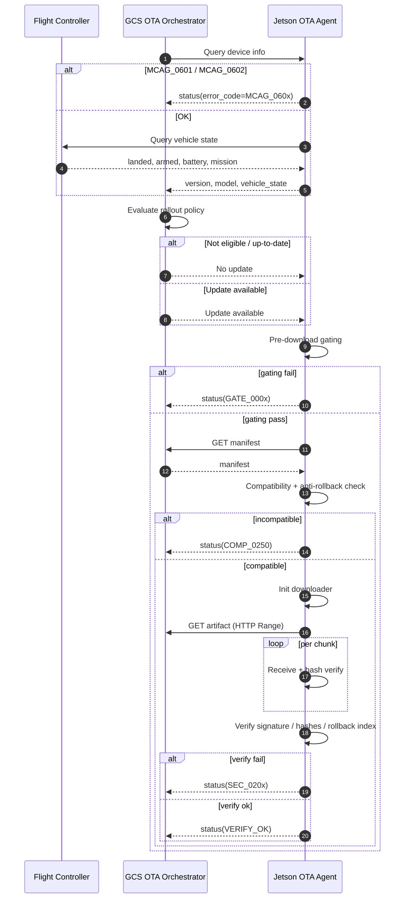
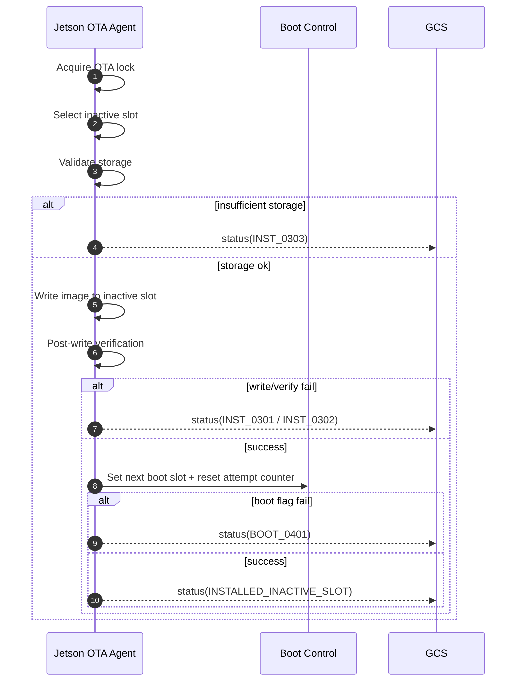
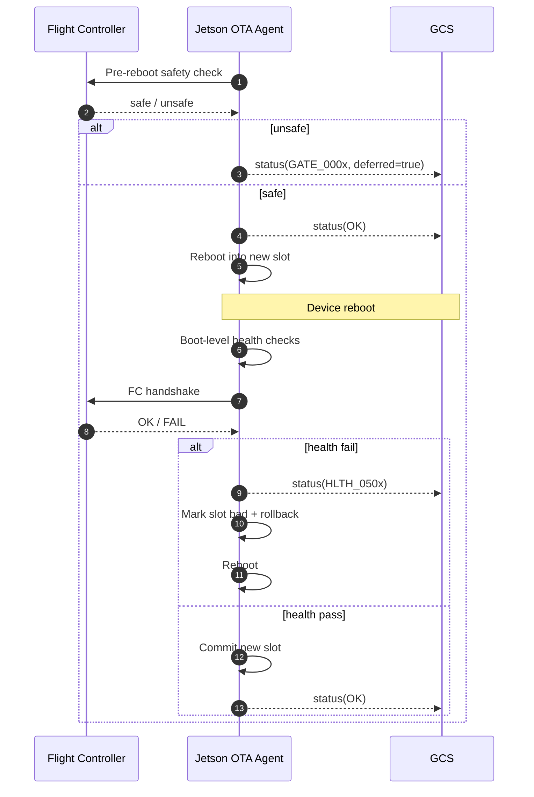

# Jetson Orin Drone OTA Design

## GCS-mediated OTA with Error Codes — FULL DESIGN (Overview + Flows 1→6)

---

## Global Overview

This document defines a **production-grade OTA (Over-The-Air Update)** architecture for **Jetson Orin–based drones**, designed with safety, security, and fleet-scale operability in mind.

### Core Principles

* **Safety-first**

  * No install or reboot while airborne
  * Flight Controller (FC) is the final safety authority
* **Authority separation**

  * GCS decides *what / when / who* to update
  * Jetson OTA Agent executes update steps
  * FC enforces flight and reboot safety
* **Atomicity**

  * A/B rootfs with automatic rollback
* **Security**

  * Offline-signed manifests and artifacts
  * Device authentication via mTLS
  * Anti-rollback protection
* **Observability**

  * Deterministic OTA states
  * Machine-readable error codes
  * Idempotent status reporting

All diagrams use **Mermaid-compatible syntax** and can be reviewed directly in **VS Code**.

---

## 1) Error Code Model

### Purpose

* Machine-readable failure handling
* Fleet-level automation (retry, defer, quarantine, rollback)
* Safety / FMEA traceability

### Rules

* Format: `DOMAIN_XXXX`
* Always report `{state, error_code}`
* One dominant error per failure path

### Core Error Code Set (excerpt)

| Domain | Error Code | Meaning                             |
| ------ | ---------- | ----------------------------------- |
| GATE   | GATE_0001  | Vehicle armed                       |
| GATE   | GATE_0002  | Not landed                          |
| GATE   | GATE_0003  | Battery below threshold             |
| NET    | NET_0005   | HTTP Range / resume unsupported     |
| DL     | DL_0101    | Chunk hash mismatch                 |
| SEC    | SEC_0201   | Manifest signature invalid          |
| SEC    | SEC_0202   | Certificate chain invalid / expired |
| SEC    | SEC_0203   | Artifact hash mismatch              |
| SEC    | SEC_0204   | Anti-rollback violation             |
| COMP   | COMP_0250  | Incompatible hardware / software    |
| INST   | INST_0301  | Write inactive slot failed          |
| INST   | INST_0302  | Post-write verification failed      |
| INST   | INST_0303  | Insufficient storage                |
| BOOT   | BOOT_0401  | Failed to set boot flags            |
| HLTH   | HLTH_0503  | Flight controller handshake failed  |
| MCAG   | MCAG_0601  | OTA-Agent service unavailable       |
| MCAG   | MCAG_0602  | OTA-Agent internal error            |

---

## 2) System Architecture — Block Diagram

### Explanation

* Signing Service signs all OTA manifests and artifacts.
* OTA Backend stores artifacts and rollout metadata (optional).
* GCS OTA Orchestrator is the OTA authority and controls rollout decisions.
* Jetson OTA Agent executes OTA operations but does not decide rollout policy.
* Flight Controller enforces safety gating (e.g. armed / in-flight checks).
* A/B Boot Chain guarantees atomic updates and automatic rollback.

### Notes

* **Control-plane**: manifest, policy, status (GCS ↔ Agent)
* **Data-plane**: artifact download (via GCS cache or Cloud/CDN)
* Proxy / MC service handles authentication, rate limiting, and auditing but **never modifies artifacts or manifests**.

## 3) System overview Phase Map

---

## 4) OTA-Agent state machine

### Explanation

This diagram represents the end-to-end OTA state flow executed by the Jetson OTA Agent, from idle to completion. It is designed to be deterministic, restart-safe, and auditable.

Key characteristics:

* The OTA Agent always starts and ends in the IDLE state.
* All safety checks occur before any irreversible action (install or reboot).
* Download and verification are separated from installation.
* Reboot is explicitly gated by the Flight Controller.
* Health validation decides commit vs rollback automatically.

State descriptions:

* IDLE: State where no communication with GCS nor is there any update in progress
* DOWNLOAD: There is an update available for device and try to download.
* INSTALL: Writes update to the inactive A/B slot only.
* REBOOT: System prepared for reboot, waiting for final safety approval.
* COMMIT: Device is up and running after rebooting, commit makes the update persistent
* FAILURE: Reports Failure to GCS, clean up and recovery.
* ROLLBACK: If the new update is broken and need to go back the previous one.

Any failure in the workflow results in a safe return to IDLE, either immediately or after rollback.

---

## 5) Sequence — Check + Decide + Download

### Explanation

This phase determines **whether an update should happen** and **safely prepares artifacts** without modifying the running system.

* GCS queries the OTA Agent to obtain software version, model, and vehicle state.
* The OTA Agent queries the Flight Controller (FC) to confirm flight safety signals (armed, landed, battery, mission state).
* GCS evaluates rollout policy (version targeting, phased rollout, blacklists).
* Pre-download gating ensures downloads only happen under acceptable ground conditions.
* The manifest defines compatibility, hashes, rollback index, and signatures.
* Artifacts are downloaded using resumable HTTP Range requests.
* Integrity is verified at chunk-level and full-artifact level.
* No persistent system changes occur in this phase; failures always return to IDLE.

This design allows **safe retries, bandwidth control, and offline preparation** before installation.

---

## 6) Sequence — Install to Inactive Slot (A/B)

### Explanation

This phase performs the **atomic installation** of the new software while protecting the currently running system.

* A single-writer lock prevents concurrent OTA attempts.
* The OTA Agent selects the inactive rootfs slot.
* Storage capacity and filesystem integrity are validated before writing.
* The new image is written only to the inactive slot.
* A post-write verification step confirms data integrity.
* Boot flags are updated *only after* a successful write and verification.
* The active slot remains untouched at all times.

If any failure occurs, the device remains bootable on the previous slot, guaranteeing **non-bricking behavior**.

---

## 7) Sequence — Reboot + Health + Rollback

### Explanation

This phase transitions execution to the new slot and validates system correctness before committing the update.

* A final safety check with the Flight Controller ensures reboot is allowed.
* Reboots are deferred if the vehicle is armed, airborne, or unsafe.
* After reboot, the OTA Agent performs layered health checks:

  * OS and critical service availability
  * Application and middleware health
  * FC handshake and telemetry sanity
* On any failure, the new slot is marked bad and an automatic rollback occurs.
* Commit only happens after all checks pass.

This guarantees **fail-safe behavior**, even across power loss or partial updates.

---

## Final Guarantees

* No OTA install or reboot while airborne
* Cryptographically verified artifacts
* Automatic rollback on any failure
* GCS-controlled rollout policy
* Deterministic, auditable OTA state machine

---

## There are 3 critical steps in OTA
- [1. Sequence — Check + Decide + Download](#5-sequence--check--decide--download)
- [2. Sequence — Install to Inactive Slot (A/B)](#6-sequence--install-to-inactive-slot-ab)
- [3. Sequence — Reboot + Health + Rollback](#7-sequence--reboot--health--rollback)

## Q&A
1) When introducing an *OTA-Agent* service, how should it communicate with the *GCS*? Should all *GCS* interactions be routed through an existing proxy MC service?

---

